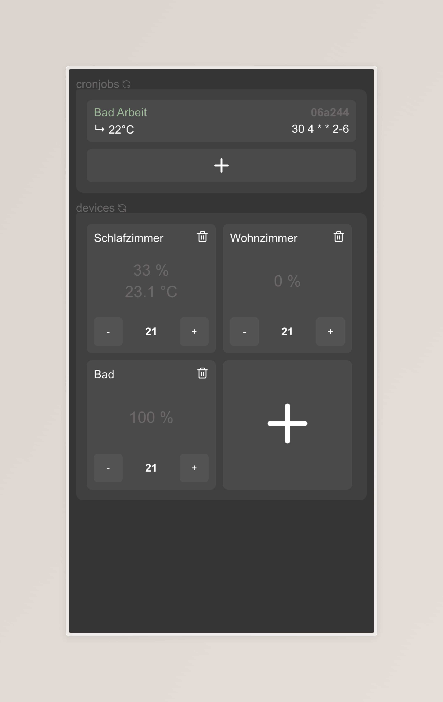

# Max Cube Control Center

## Introduction
The Max Cube Control Center allows you to control your Max Cube devices from a modern user interface. Follow the guide below to set up the project quickly.

## Features
- Set device temperatures
- Schedule temperature changes using cron-jobs (! crons are specified using UTC time zone, so adjust them accordingly)

## Preview


## Requirements
- Docker
- Docker Compose

## Setup Instructions
1. Ensure you have Docker and Docker Compose installed.
2. Use the provided docker-compose.yml file.
3. Run `docker compose up -d` to start the services.

## Sample docker-compose.yml
Below is the configuration used for this project:

```dockercompose
services:
  backend:
    image: ghcr.io/m1kx/max-cube-backend:latest
    environment:
      - CUBE_IP_ADDRESS=192.168.0.153 # update with your Max Cube IP
      - APIKEY=secretpassword
    volumes:
      - ./data:/app/data
  frontend:
    image: ghcr.io/m1kx/max-cube-frontend:latest
    ports:
      - "3000:3000"
```

Make sure to update `APIKEY` with a secure password and `CUBE_IP_ADDRESS` with the IP address of your Max Cube.

## Additional Notes
- Cron jobs are specified using UTC time. Adjust the schedule accordingly.
- Once the services are running, open your browser at http://localhost:3000 (or replace "localhost" with your host IP) to access the control center.

When everything works, you should be able to control your devices with ease 🎉